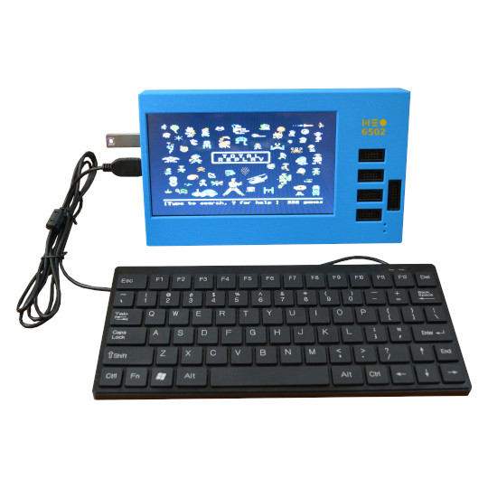

# Neo6502pc
World fastest 6502 computer. All in one Open Source Hardware and Software Modern Retro computer with real 6502 processor, HDMI, USB Flash drive, USB Gamepads, mouse, Keyboard support.

https://www.olimex.com/Products/Retro-Computers/Neo6502pc/open-source-hardware

## Licensee
* Hardware is released under CERN Open Hardware Licence Version 2 - Strongly Reciprocal
* Software is released under GPL V3 Licensee
* Documentation is released under CC BY-SA 4.0